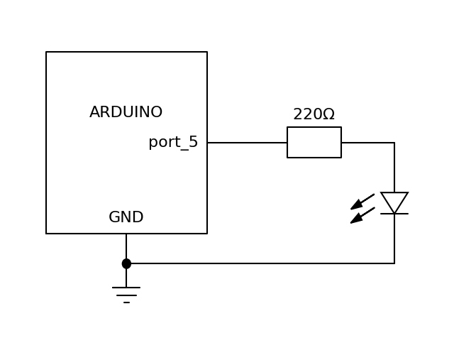

# 小灯闪烁实验

最基本的小实验,实现让led小灯反复闪烁.目的就是熟悉arduino的数字i/o操作,顺便验证环境搭建的正确与否.

## 器材

1. led小灯
2. 1000欧姆稳流电阻
3. 面包板

## 电路图



## 程序

本程序使用数字输入输出端口的5号口,程序如下:

```C++
auto ledPin=5;
// the setup function runs once when you press reset or power the board
void setup() {
  // initialize digital pin LED_BUILTIN as an output.
  pinMode(ledPin, OUTPUT);
}

// the loop function runs over and over again forever
void loop() {
  digitalWrite(ledPin, HIGH);   // turn the LED on (HIGH is the voltage level)
  delay(1000);                       // wait for a second
  digitalWrite(ledPin, LOW);    // turn the LED off by making the voltage LOW
  delay(1000);                       // wait for a second
}
```
