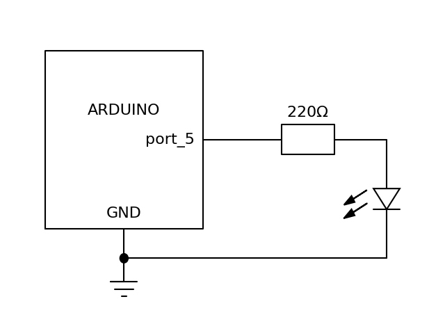

# 串口控制小灯闪烁实验

本实验是前几个实验的总结,通过串口,用指定字符控制面包版上小灯点亮1000毫秒.

## 器材

1. led小灯
2. 1000欧姆稳流电阻
3. 面包板

## 电路图



## 程序

本程序使用数字输入输出端口的5号口,程序如下:

```C++
auto ledPin=5;
int val;
void setup() {
 pinMode(ledPin,OUTPUT);
 Serial.begin(9600);
}

void loop() {
  val = Serial.read();
  if(-1 != val){
    if('H' == val){
      digitalWrite(ledPin,HIGH);
      delay(1000);
      digitalWrite(ledPin,LOW);
       Serial.println(char(val));
      Serial.print("Available:");
      Serial.println(Serial.available(),DEC);
    }
  }
}
```
