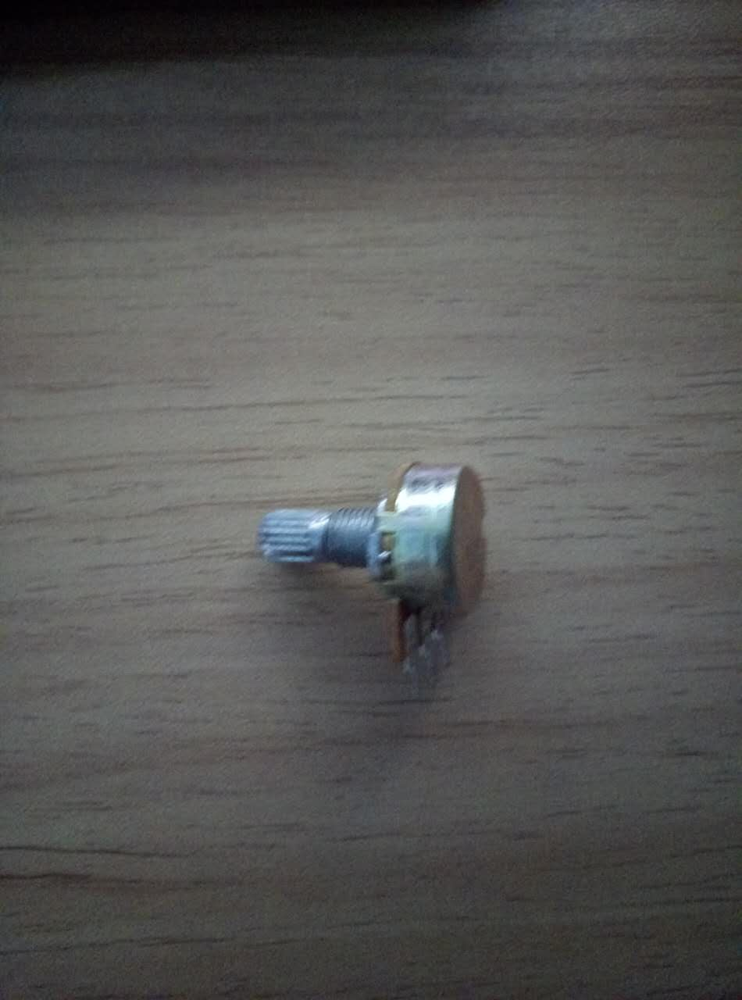

# 模拟输入输出

除了可以输入输出数字信号,arduino还可以输入输出模拟信号.

## 器材

1. led小灯
2. 1000欧姆稳流电阻
3. 面包板
4. 电位器

所谓电位器就是初中物理课上的滑动变阻器,它可以通过旋转旋钮改变需要的阻值大小,接法是两端接高低电频,但需要可调的部分接在中间.
它长这样


## 电路图


## 关于模拟信号的输入和输出

### 读出

arduino可以从指定的引脚读取数值,uno有A0到A5共6个引脚可以用来实现moisture信号的输入,而读取精度和范围为,5v/1024也就是月等于每个单位0.049v,输入的范围可以通过analogReference()来修改.

模拟输入的读取周期为100微秒,最大读取速度为10000次/s,需要注意的是即便啥也不接,模拟引脚也会有数值,这不是哪里有错,而是自然界本身有电引起的.

### 写入

模拟信号的写入与数字信号的共用一些端口,像uno可以输出模拟信号的端口有3,5,6,9,10,11,共6个.取值为0到255的整数.

事实上输出的所谓模拟信号是使用PWM数转模的结果,其原理是使用一定频率的脉冲模拟出模拟信号.

## 程序

本程序使用数字输入输出端口的3号口和模拟输入口A5口,程序如下:

```C++
auto analogPin = A5;
auto ledPin = 3;
auto val = 0;
void setup() {
  Serial.begin(9600);
  pinMode(ledPin,OUTPUT);
}

void loop() {
  val=analogRead(analogPin);
  Serial.println(val);
  analogWrite(ledPin,val/4);
  delay(1000);
}
```
